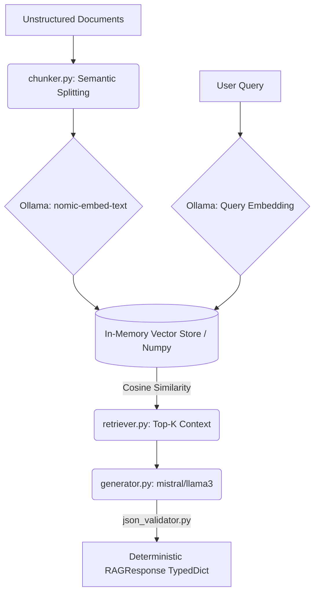

# Enterprise RAG System — Air-Gapped Local Edition

A modular, privacy-first Retrieval-Augmented Generation (RAG) pipeline designed to extract, synthesize, and enforce structured insights from unstructured data.

This system runs entirely on local hardware via Ollama, requiring zero cloud APIs or external data transmission. It is engineered for environments where data privacy, offline operation, and deterministic JSON outputs are strict enterprise requirements.

This architecture can be extended to financial planning documents, operational reports, and internal knowledge bases to support structured decision-support systems.

---

## 🏗️ System Architecture & Workflow



---

## 🔐 Privacy & Deployment Model

| Property | Behaviour |
|---|---|
| **Data residency** | All documents, embeddings, and model weights remain on-device |
| **Network calls** | Zero — Ollama binds to `127.0.0.1:11434` (localhost only) |
| **API keys** | None required |
| **Air-gap compatible** | Yes — once models are pulled, fully offline operation |
| **Vector store** | In-memory NumPy array; no external vector DB process required |

This architecture is designed for environments where data residency and local execution are strict requirements.

---

## 📐 Design Principles

### 1. Strict Separation of Concerns

Each pipeline stage is an independent Python module with a single responsibility:

| Module | Responsibility | External calls |
|---|---|---|
| `rag/_http.py` | Shared Ollama HTTP transport | Ollama (localhost) |
| `rag/ingestion.py` | Multi-document loading, chunking, and embedding | Ollama `/api/embeddings` |
| `rag/chunker.py` | Word-boundary text segmentation | None |
| `rag/embedder.py` | Dense vector encoding | Ollama `/api/embeddings` |
| `rag/retriever.py` | Cosine similarity ranking | None |
| `rag/generator.py` | Context-grounded generation | Ollama `/api/generate` |
| `validator/json_validator.py` | Output schema enforcement | None |
| `app.py` | Pipeline orchestration | None |

### 2. Deterministic Structured Output

Every pipeline response is enforced against the `RAGResponse` TypedDict before it is returned. The validator raises a typed `ValidationError` on any schema violation — there are no silent failures or untyped dict returns in the public API.

```python
class RAGResponse(TypedDict):
    query:   str        # original user question
    answer:  str        # LLM-generated, context-grounded answer
    sources: List[str]  # top-k retrieved passages (full text)
    model:   str        # Ollama generation model used
```

### 3. In-Memory Vector Store for Air-Gapped Privacy

The retrieval corpus is maintained as a `float32` NumPy array computed at startup. This design eliminates the need for a vector database daemon, reduces the attack surface to zero external processes, and allows deterministic retrieval behaviour without index approximation errors.

For scale-out, the corpus array can be persisted with `np.save / np.load` or substituted with a FAISS index behind the same `retrieve()` interface — no downstream code changes required.

### 4. Single Transport Layer

All Ollama API calls are routed through `rag/_http.py::ollama_post()`. This provides a single point of control for timeouts, retry logic, authentication headers, and proxy configuration — none of which are scattered across business-logic modules.

---

## 🚀 Local Setup

### Prerequisites

```bash
# 1. Install Ollama — https://ollama.ai/download

# 2. Pull inference models
ollama pull nomic-embed-text   # embedding model (274 MB)
ollama pull mistral            # generation model (or: llama3, phi3, gemma)

# 3. Start the Ollama server
ollama serve
```

### Install Python dependencies

```bash
pip install -r requirements.txt    # numpy + streamlit only
```

### Run — CLI

```bash
cd enterprise-rag-system
python app.py
python app.py "What is the role of cosine similarity in retrieval?"
```

### Run — Browser UI

```bash
python -m streamlit run streamlit_app.py
# → http://localhost:8501
```

---

## � Multi-Document Corpus Support

The ingestion pipeline automatically scans the `data/` directory and builds a unified embedding corpus across multiple documents. Each chunk retains source-level metadata, enabling:

- **Cross-document retrieval** — a single query searches across all loaded documents simultaneously
- **Source attribution** — every retrieved passage is annotated with its originating filename
- **Auditability** — the full `RAGResponse` includes which document each answer was drawn from
- **Future filtering** — source metadata can be extended to support filtering by document type, date, or classification level

This enables retrieval across heterogeneous enterprise documents such as financial policies, budget reports, and compliance manuals.

### Current Corpus

```
data/
├── financial_policy.txt       ← expense authorization, variance policy, procurement rules
├── budgeting_framework.txt    ← planning calendar, headcount budgeting, scenario planning
└── audit_controls.txt         ← COSO framework, control testing, findings remediation
```

To add documents, drop any `.txt` file into `data/` and restart the application. No code changes required.

---

## �🔄 Pipeline Flow (Step-by-Step)

**Phase 1 — Ingestion** *(executed once per knowledge base)*

| Step | Module | Action |
|---|---|---|
| 1 | `chunker.py` | Segments document into overlapping word-boundary chunks (configurable size & overlap) |
| 2 | `embedder.py` | Encodes each chunk via `POST /api/embeddings` → `float32` NumPy array |

**Phase 2 — Query** *(executed per user question)*

| Step | Module | Action |
|---|---|---|
| 3 | `embedder.py` | Encodes the query using the same embedding model |
| 4 | `retriever.py` | Computes cosine similarity; returns top-k `(passage, score)` tuples |
| 5 | `generator.py` | Injects passages into a structured RAG prompt; calls `POST /api/generate` |
| 6 | `json_validator.py` | Validates output against `RAGResponse` schema; raises `ValidationError` on failure |

---

## ⚙️ Configuration

All runtime parameters are declared as named constants at the top of `app.py`:

```python
EMBED_MODEL   = "nomic-embed-text"   # swap for any Ollama embedding model
GEN_MODEL     = "mistral"            # swap for llama3, phi3, gemma, etc.
CHUNK_SIZE    = 300                  # approximate characters per chunk
CHUNK_OVERLAP = 50                   # character overlap between chunks
TOP_K         = 3                    # passages injected into the generation prompt
```

---

## 🧩 Extension Points

The system is designed to be extended without modifying core pipeline logic:

| Extension | How |
|---|---|
| **Swap retrieval backend** | Replace `retriever.py` internals with FAISS; `retrieve()` signature unchanged |
| **Swap embedding model** | Change `EMBED_MODEL` constant; no code changes |
| **Swap generation model** | Change `GEN_MODEL` constant; no code changes |
| **Add multi-document ingestion** | Extend `ingest()` in `app.py` to walk a directory |
| **Add streaming output** | Pass `"stream": true` to `generator.py`; yield tokens progressively |
| **Add re-ranking** | Insert a cross-encoder step between `retriever.py` and `generator.py` |
| **Expose as API** | Wrap `query_pipeline()` with a FastAPI router |

---

## 📊 Operational Characteristics

| Metric | CPU (6-core) | GPU (8 GB VRAM) |
|---|---|---|
| Embedding latency (per chunk) | ~0.5–2 s | ~0.05–0.2 s |
| Generation latency (mistral) | ~30–90 s | ~2–8 s |
| Memory footprint (model + app) | ~4–6 GB RAM | ~4 GB VRAM |
| Corpus re-embedding required? | Only on document change | Only on document change |

---

## 🔭 Roadmap

| Priority | Item | Notes |
|---|---|---|
| High | Persist corpus embeddings | `np.save / np.load` to eliminate startup re-embedding |
| High | FAISS index integration | Drop-in via `retrieve()` interface; enables sub-millisecond retrieval at scale |
| Medium | Multi-document ingestion | Walk `data/` directory; support `.pdf` via `pypdf` |
| Medium | FastAPI service layer | Expose `query_pipeline()` as a REST endpoint |
| Medium | RAGAS evaluation harness | Faithfulness, answer relevancy, context recall metrics |
| Low | Streaming token output | Client-side progressive rendering |
| Low | Cross-encoder re-ranking | Improved passage precision at the cost of additional latency |

---

## 🚀 Key Engineering Decisions

**Air-Gapped Privacy:** Full pipeline execution using local Ollama models. Zero external API calls, guaranteeing data security for sensitive enterprise documentation.

**Deterministic Structured Output:** Rather than returning raw text, the output is passed through `json_validator.py`. It enforces a `RAGResponse` TypedDict schema and raises a `ValidationError` on failure, ensuring reliable integration with downstream enterprise APIs.

**Decoupled Architecture:** Retrieval (`retriever.py`) and Generation (`generator.py`) are strictly independent modules. This allows for isolated unit testing and enables the system to easily swap the lightweight NumPy vector store for FAISS or Pinecone at massive scale.

**Shared HTTP Transport:** A single `_http.py` module handles all Ollama communication, eliminating boilerplate and centralizing timeout and error handling.

---

## 💻 Tech Stack

| Layer | Technology |
|---|---|
| **Language** | Python — stdlib-heavy, minimal external dependencies |
| **AI/LLM Engine** | Ollama (Mistral / Llama3 for generation, Nomic for embeddings) |
| **Data Storage** | In-Memory Vector Computation (NumPy float32) |
| **Architecture Patterns** | RAG, Workflow Orchestration, Typed Schema Validation |
| **UI** | Streamlit (optional browser interface) |

---

## ⚡ Pipeline Execution

**Ingestion:** Documents are parsed and split into overlapping segments to preserve cross-boundary semantic context.

**Embedding:** Chunks are vectorized via `/api/embeddings` and stacked into a dense `np.ndarray` corpus.

**Retrieval:** User queries are embedded with the same model, and cosine similarity ranks the top-k highest-scoring passages from the corpus.

**Generation:** A strict system prompt injects the retrieved context and constrains the model to ground its answer entirely in the provided passages — parametric knowledge is explicitly excluded.

**Validation:** The response is structurally validated against the `RAGResponse` TypedDict schema before being returned to the caller. Any schema violation raises a `ValidationError`, which propagates cleanly to the orchestration layer.
