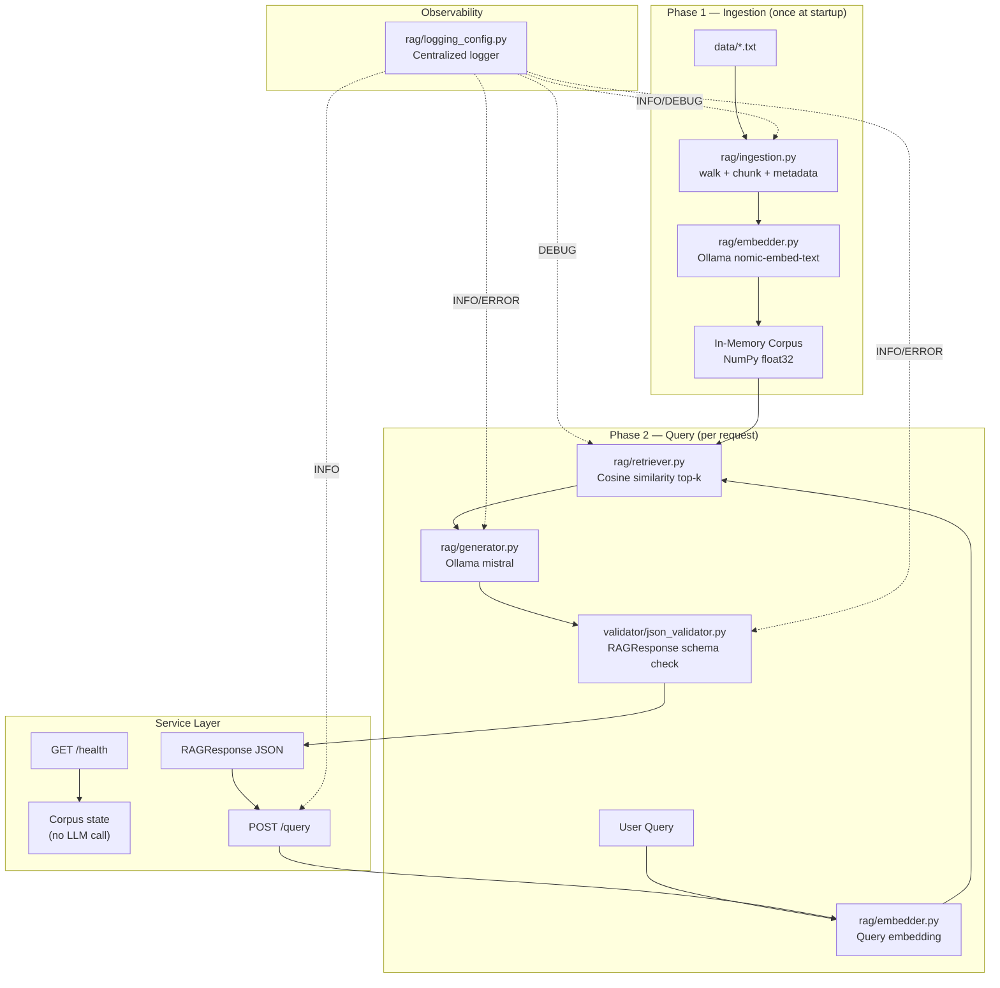

# Enterprise RAG System — FP&A Platform Edition

A modular, deterministic Retrieval-Augmented Generation (RAG) pipeline built to power enterprise Financial Planning & Analysis (FP&A) workflows. Designed for seamless backend integration, this system extracts, synthesizes, and enforces structured insights from complex financial documents, policy manuals, and operational reports.

The pipeline is exposed via a robust FastAPI service layer, enabling tight integration with multi-step agentic AI workflows and internal decision-support systems. It maintains strict standards for deterministic JSON output and data residency, executing securely on local infrastructure.

---

## 🏗️ System Architecture & Workflow



---

## 🏢 Enterprise Deployment Model

This system is built for containerized microservice environments. The RAG pipeline is packaged behind a stateless FastAPI service, making it readily consumable by upstream orchestration layers, enterprise dashboards, or multi-step agentic AI frameworks.

| Property | Implementation |
|---|---|
| **Integration** | REST API (`/query`, `/health`) designed for backend-to-backend consumption |
| **Agentic AI Ready** | Strict `RAGResponse` typing ensures predictable tool usage for autonomous agents |
| **Data Residency** | Inference runs exclusively on local infrastructure to guarantee financial data privacy |
| **Vector Storage** | NumPy baseline for prototyping; designed for zero-friction scaling to FAISS or Qdrant |

This architecture bridges the gap between secure local LLM execution and scalable enterprise service patterns.

---

## 📐 Design Principles

### 1. Strict Separation of Concerns

Each pipeline stage is an independent Python module with a single responsibility:

| Module | Responsibility | External calls |
|---|---|---|
| `rag/_http.py` | Shared Ollama HTTP transport | Ollama (localhost) |
| `rag/logging_config.py` | Centralized logging configuration | None |
| `rag/ingestion.py` | Multi-document loading, chunking, and embedding | Ollama `/api/embeddings` |
| `rag/chunker.py` | Word-boundary text segmentation | None |
| `rag/embedder.py` | Dense vector encoding | Ollama `/api/embeddings` |
| `rag/retriever.py` | Cosine similarity ranking | None |
| `rag/generator.py` | Context-grounded generation | Ollama `/api/generate` |
| `validator/json_validator.py` | Output schema enforcement | None |
| `service/api.py` | FastAPI REST service layer | None |
| `app.py` | Pipeline orchestration (CLI) | None |

### 2. Deterministic Structured Output

Every pipeline response is enforced against the `RAGResponse` TypedDict before it is returned. The validator raises a typed `ValidationError` on any schema violation — there are no silent failures or untyped dict returns in the public API.

```python
class RAGResponse(TypedDict):
    query:   str        # original user question
    answer:  str        # LLM-generated, context-grounded answer
    sources: List[str]  # top-k retrieved passages (full text)
    model:   str        # Ollama generation model used
```

### 3. Lightweight Prototyping Vector Store

The retrieval corpus is maintained as a `float32` NumPy array. This provides a zero-dependency, in-memory backend ideal for rapid prototyping and verifying deterministic retrieval behaviour without index approximation errors.

For production scale-out, this prototyping backend provides a clear architectural path to be substituted with a dedicated vector database such as FAISS or Qdrant. Because retrieval logic is isolated behind the `retrieve()` interface, scaling the vector engine requires zero downstream code changes to the generation or validation layers.

### 4. Single Transport Layer

All Ollama API calls are routed through `rag/_http.py::ollama_post()`. This provides a single point of control for timeouts, retry logic, authentication headers, and proxy configuration — none of which are scattered across business-logic modules.

---

## 🚀 Local Setup

### Prerequisites

```bash
# 1. Install Ollama — https://ollama.ai/download

# 2. Pull inference models
ollama pull nomic-embed-text   # embedding model (274 MB)
ollama pull mistral            # generation model (or: llama3, phi3, gemma)

# 3. Start the Ollama server
ollama serve
```

### Install Python dependencies

```bash
pip install -r requirements.txt    # numpy + streamlit only
```

### Run — CLI

```bash
cd enterprise-rag-system
python app.py
python app.py "What is the role of cosine similarity in retrieval?"
```

### Run — Browser UI

```bash
python -m streamlit run streamlit_app.py
# → http://localhost:8501
```

---

## � Multi-Document Corpus Support

The ingestion pipeline automatically scans the `data/` directory and builds a unified embedding corpus across multiple documents. Each chunk retains source-level metadata, enabling:

- **Cross-document retrieval** — a single query searches across all loaded documents simultaneously
- **Source attribution** — every retrieved passage is annotated with its originating filename
- **Auditability** — the full `RAGResponse` includes which document each answer was drawn from
- **Future filtering** — source metadata can be extended to support filtering by document type, date, or classification level

This enables retrieval across heterogeneous enterprise documents such as financial policies, budget reports, and compliance manuals.

### Current Corpus

```text
data/
├── financial_policy.txt       ← expense authorization, variance policy, procurement rules
├── budgeting_framework.txt    ← planning calendar, headcount budgeting, scenario planning
└── audit_controls.txt         ← COSO framework, control testing, findings remediation
```

To add documents, drop any `.txt` file into `data/` and restart the application. No code changes required.

---

## �🔄 Pipeline Flow (Step-by-Step)

**Phase 1 — Ingestion** *(executed once per knowledge base)*

| Step | Module | Action |
|---|---|---|
| 1 | `chunker.py` | Segments document into overlapping word-boundary chunks (configurable size & overlap) |
| 2 | `embedder.py` | Encodes each chunk via `POST /api/embeddings` → `float32` NumPy array |

**Phase 2 — Query** *(executed per user question)*

| Step | Module | Action |
|---|---|---|
| 3 | `embedder.py` | Encodes the query using the same embedding model |
| 4 | `retriever.py` | Computes cosine similarity; returns top-k `(passage, score)` tuples |
| 5 | `generator.py` | Injects passages into a structured RAG prompt; calls `POST /api/generate` |
| 6 | `json_validator.py` | Validates output against `RAGResponse` schema; raises `ValidationError` on failure |

---

## ⚙️ Configuration

All runtime parameters are declared as named constants at the top of `app.py`:

```python
EMBED_MODEL   = "nomic-embed-text"   # swap for any Ollama embedding model
GEN_MODEL     = "mistral"            # swap for llama3, phi3, gemma, etc.
CHUNK_SIZE    = 300                  # approximate characters per chunk
CHUNK_OVERLAP = 50                   # character overlap between chunks
TOP_K         = 3                    # passages injected into the generation prompt
```

---

---

## 🌐 API Usage

The FastAPI service wraps the full pipeline behind a REST interface. The corpus is loaded once at startup and held in memory for subsequent requests.

### Start the server

```bash
uvicorn service.api:app --reload
# Available at http://127.0.0.1:8000
# Interactive docs at http://127.0.0.1:8000/docs
```

### Health check

```bash
curl http://127.0.0.1:8000/health
```

```json
{
  "status": "ok",
  "embedding_model": "nomic-embed-text",
  "generation_model": "mistral",
  "documents_loaded": 3
}
```

The health endpoint does not trigger embeddings or LLM calls. It reads in-memory state only.

### Query

```bash
curl -X POST http://127.0.0.1:8000/query \
     -H "Content-Type: application/json" \
     -d '{"query": "Explain the audit control policy."}'
```

```json
{
  "query": "Explain the audit control policy.",
  "answer": "The audit control policy is organised around the COSO framework...",
  "sources": [
    {"text": "Section 2 — COSO Framework Alignment...", "source": "audit_controls.txt"},
    {"text": "Tier 3 — Capital and Strategic Expenditures...", "source": "financial_policy.txt"}
  ],
  "model": "mistral"
}
```

### Error codes

| Code | Condition |
|---|---|
| `422` | Empty or malformed request body |
| `503` | Ollama is unreachable at query time |
| `500` | Pipeline output failed schema validation |

The CLI (`python app.py`) and Streamlit UI (`streamlit run streamlit_app.py`) remain fully independent of the API server.

---

## 🔎 Observability

All pipeline modules emit structured log lines via Python's built-in `logging` module. No external logging libraries are used.

Logging is centralised in `rag/logging_config.py`. Every module calls `get_logger(__name__)` to obtain a child logger under the `rag.*` namespace. All output goes to stdout.

**Log format:**

```text
YYYY-MM-DD HH:MM:SS [LEVEL   ] logger.name — message
```

**What is captured:**

| Stage | Level | Events |
|---|---|---|
| Ingestion | INFO | Start, document count, chunk totals, embedding complete |
| Ingestion | DEBUG | Per-document chunk counts |
| Retrieval | DEBUG | Top-k passage scores and source filenames |
| Generation | INFO | Request (model, query preview), success (answer length) |
| Generation | ERROR | Ollama connection failure |
| Validation | INFO | Pass — query preview and source count |
| Validation | ERROR | Fail — field name and reason |
| API service | INFO | Startup, `/health` hits, query received, query complete |

**Default level:** `INFO` — sufficient for production monitoring.

**Enable DEBUG** for retrieval scores and per-document chunk counts:

```python
import logging
logging.getLogger("rag").setLevel(logging.DEBUG)
```

---

## 🧩 Extension Points

The system is designed to be extended without modifying core pipeline logic:

| Extension | How |
|---|---|
| **Swap retrieval backend** | Replace `retriever.py` internals with FAISS; `retrieve()` signature unchanged |
| **Swap embedding model** | Change `EMBED_MODEL` constant in `app.py`; no code changes elsewhere |
| **Swap generation model** | Change `GEN_MODEL` constant in `app.py`; no code changes elsewhere |
| **Add streaming output** | Pass `"stream": true` to `generator.py`; yield tokens progressively |
| **Add re-ranking** | Insert a cross-encoder step between `retriever.py` and `generator.py` |
| **Add PDF support** | Extend `rag/ingestion.py` to call `pypdf` before chunking |

---

## 📊 Operational Characteristics

| Metric | CPU (6-core) | GPU (8 GB VRAM) |
|---|---|---|
| Embedding latency (per chunk) | ~0.5–2 s | ~0.05–0.2 s |
| Generation latency (mistral) | ~30–90 s | ~2–8 s |
| Memory footprint (model + app) | ~4–6 GB RAM | ~4 GB VRAM |
| Corpus re-embedding required? | Only on document change | Only on document change |

---

## 🔭 Roadmap

| Priority | Item | Notes |
|---|---|---|
| High | Persist corpus embeddings | `np.save / np.load` to eliminate startup re-embedding |
| High | FAISS index integration | Drop-in via `retrieve()` interface; enables sub-millisecond retrieval at scale |
| Medium | PDF ingestion | Extend `rag/ingestion.py` with `pypdf`; no pipeline changes needed |
| Medium | RAGAS evaluation harness | Faithfulness, answer relevancy, context recall metrics |
| Low | Streaming token output | Client-side progressive rendering |
| Low | Cross-encoder re-ranking | Improved passage precision at the cost of additional latency |

---

## 🚀 Key Engineering Decisions

**Data Residency & Security:** Full pipeline execution uses locally hosted Ollama models. This ensures absolute data privacy for sensitive corporate financial documentation, with no external cloud API dependencies.

**Deterministic Structured Output:** Rather than returning raw text, the output is passed through `json_validator.py`. It enforces a `RAGResponse` TypedDict schema and raises a `ValidationError` on failure, ensuring reliable integration with downstream enterprise APIs.

**Decoupled Architecture:** Retrieval (`retriever.py`) and Generation (`generator.py`) are strictly independent modules. This allows for isolated unit testing and enables the system to easily swap the lightweight NumPy vector store for FAISS or Pinecone at massive scale.

**Shared HTTP Transport:** A single `_http.py` module handles all Ollama communication, eliminating boilerplate and centralizing timeout and error handling.

---

## 💻 Tech Stack

| Layer | Technology |
|---|---|
| **Language** | Python — stdlib-heavy, minimal external dependencies |
| **AI/LLM Engine** | Ollama (Mistral / Llama3 for generation, Nomic for embeddings) |
| **Data Storage** | In-Memory Vector Computation (NumPy float32) |
| **Architecture Patterns** | RAG, Workflow Orchestration, Typed Schema Validation |
| **UI** | Streamlit (optional browser interface) |

---

## ⚡ Pipeline Execution

**Ingestion:** Documents are parsed and split into overlapping segments to preserve cross-boundary semantic context.

**Embedding:** Chunks are vectorized via `/api/embeddings` and stacked into a dense `np.ndarray` corpus.

**Retrieval:** User queries are embedded with the same model, and cosine similarity ranks the top-k highest-scoring passages from the corpus.

**Generation:** A strict system prompt injects the retrieved context and constrains the model to ground its answer entirely in the provided passages — parametric knowledge is explicitly excluded.

**Validation:** The response is structurally validated against the `RAGResponse` TypedDict schema before being returned to the caller. Any schema violation raises a `ValidationError`, which propagates cleanly to the orchestration layer.
