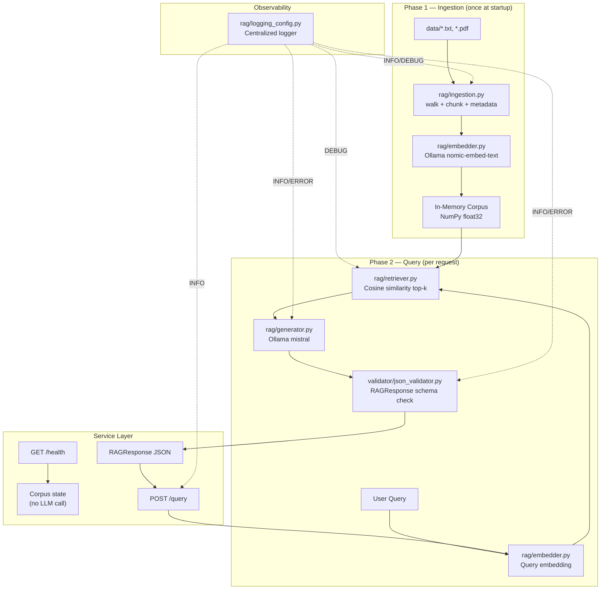

# Enterprise RAG System — FP&A Platform Edition

[](https://github.com/pavann19/enterprise-rag-system/actions/workflows/ci.yml)
[](LICENSE)
[](https://enterprise-rag-system-p.streamlit.app/)

**🔗 Live demo (Streamlit): [enterprise-rag-system-p.streamlit.app](https://enterprise-rag-system-p.streamlit.app/)** — running `EMBED_BACKEND=local` + `GEN_BACKEND=groq` (see [Hosted / Public Demo](#-hosted--public-demo)). No setup, no cloning — click and ask a question.

**🔗 Live demo (Next.js): [enterprise-rag-system-pavann19.vercel.app](https://enterprise-rag-system-pavann19.vercel.app/)** — the same backend behind a purpose-built frontend instead of Streamlit's component model; see [Web Frontend](#-web-frontend-nextjs) for why it exists and how it's deployed. Its API runs on Render's free tier, which sleeps after inactivity — the first question after a while asleep takes ~15-20s longer (cold start + re-embedding the corpus) before it starts streaming.

A modular, deterministic Retrieval-Augmented Generation (RAG) pipeline built to power enterprise Financial Planning & Analysis (FP&A) workflows. Designed for seamless backend integration, this system extracts, synthesizes, and enforces structured insights from complex financial documents, policy manuals, and operational reports.

The pipeline is exposed via a FastAPI service layer, enabling integration with multi-step agentic AI workflows and internal decision-support systems. Output is schema-validated on every request. Inference runs entirely on local infrastructure (Ollama) by default; an explicit, opt-in cloud path exists for public demo hosting — see [Hosted / Public Demo](#-hosted--public-demo).

---

## 🏗️ System Architecture & Workflow


```mermaid
graph TD
    subgraph Ingestion ["Phase 1 — Ingestion (once at startup)"]
        A["data/*.txt, *.pdf"] --> B["rag/ingestion.py\nwalk + chunk + metadata"]
        B --> C["rag/embedder.py\nOllama nomic-embed-text"]
        C --> D["In-Memory Corpus\nNumPy float32"]
    end

    subgraph Query ["Phase 2 — Query (per request)"]
        E["User Query"] --> F["rag/embedder.py\nQuery embedding"]
        F --> G["rag/retriever.py\nCosine similarity top-k"]
        G --> H["rag/generator.py\nOllama mistral"]
        H --> I["validator/json_validator.py\nRAGResponse schema check"]
    end

    subgraph ServiceLayer ["Service Layer"]
        J["GET /health"] --> K["Corpus state\n(no LLM call)"]
        L["POST /query"] --> F
        I --> M["RAGResponse JSON"]
        M --> L
    end

    subgraph Observability ["Observability"]
        N["rag/logging_config.py\nCentralized logger"]
        N -.->|INFO/DEBUG| B
        N -.->|DEBUG| G
        N -.->|INFO/ERROR| H
        N -.->|INFO/ERROR| I
        N -.->|INFO| L
    end

    D --> G
```

---

## 🏢 Enterprise Deployment Model

This system is built for containerized microservice environments. The RAG pipeline is packaged behind a stateless FastAPI service, making it readily consumable by upstream orchestration layers, enterprise dashboards, or multi-step agentic AI frameworks.

| Property | Implementation |
|---|---|
| **Integration** | REST API (`/query`, `/health`) designed for backend-to-backend consumption |
| **Agentic AI Ready** | Strict `RAGResponse` typing ensures predictable tool usage for autonomous agents |
| **Data Residency** | Inference runs on local infrastructure by default (`EMBED_BACKEND=ollama`, `GEN_BACKEND=ollama`); switching either to its cloud alternative is a deliberate, explicit config choice — never an implicit fallback |
| **Vector Storage** | NumPy baseline for prototyping; swappable to FAISS or Qdrant via `VECTOR_BACKEND` |

This architecture bridges the gap between secure local LLM execution and scalable enterprise service patterns.

---

## 📐 Design Principles

### 1. Strict Separation of Concerns

Each pipeline stage is an independent Python module with a single responsibility:

| Module | Responsibility | External calls |
|---|---|---|
| `rag/_http.py` | Shared Ollama HTTP transport | Ollama (localhost) |
| `rag/logging_config.py` | Centralized logging configuration | None |
| `rag/loaders.py` | Per-format text extraction (.txt, .pdf) | None (.pdf needs `pypdf`) |
| `rag/ingestion.py` | Multi-document walking, chunking, and embedding | Ollama `/api/embeddings` |
| `rag/chunker.py` | Word-boundary text segmentation | None |
| `rag/embedder.py` | Dense vector encoding | Ollama `/api/embeddings` (default) or in-process sentence-transformers |
| `rag/vector_store.py` | Pluggable similarity index (NumPy / FAISS / Qdrant), with save/load | None |
| `rag/retriever.py` | Translates vector-store hits into chunk text + source metadata | None |
| `rag/generator.py` | Context-grounded generation | Ollama `/api/generate` (default), Claude API, or Groq API |
| `validator/json_validator.py` | Output schema enforcement | None |
| `service/api.py` | FastAPI REST service layer | None |
| `service/rate_limiter.py` | In-memory per-client rate limiting | None |
| `app.py` | Pipeline orchestration (CLI) | None |

### 2. Deterministic Structured Output

Every pipeline response is enforced against the `RAGResponse` TypedDict before it is returned. The validator raises a typed `ValidationError` on any schema violation — there are no silent failures or untyped dict returns in the public API.

```python
class RAGResponse(TypedDict):
    query:   str               # original user question
    answer:  str               # LLM-generated, context-grounded answer
    sources: List[SourceEntry] # top-k retrieved passages, each {"text", "source"}
    model:   str                # Ollama generation model used
```

### 3. Pluggable Vector Store, With Persistence

Similarity search is hidden behind a `VectorStore` interface (`rag/vector_store.py`) with three interchangeable backends:

- **`numpy`** (default) — exact cosine similarity over a `float32` array. Zero extra dependencies.
- **`faiss`** (optional, `pip install faiss-cpu`) — exact inner-product search via `IndexFlatIP` over L2-normalized vectors, same ranking semantics, backed by a purpose-built similarity-search library.
- **`qdrant`** (optional, `pip install qdrant-client`) — cosine search via Qdrant's embedded/local mode, no Qdrant server to run. **Note the tradeoff:** `save()`/`load()` persist the raw embedding matrix and rebuild an in-memory collection on load, the same way `numpy` does — not Qdrant's own on-disk index format. That was the faster path to something genuinely working end to end; Qdrant's own local-mode storage holds an exclusive file lock for as long as a client has it open, which doesn't fit this project's ingest-once/query-later-in-a-different-process cache pattern without extra lock handling. If you're evaluating Qdrant specifically for its storage engine rather than its query API, know that this backend gives you the latter, not the former.

`rag/retriever.py` calls `vector_store.search()` and has no idea which backend is underneath — swapping backends is a one-line config change (`VECTOR_BACKEND` in `app.py`), not a rewrite.

All three backends persist to disk. `rag/ingestion.py::ingest()` accepts a `cache_dir`; the embedded corpus (chunks, metadata, and the index itself) is cached under a fingerprint hashed from document contents + chunking/embedding config. An unchanged corpus loads straight from disk on the next run — no re-embedding, no Ollama calls — until a document or config actually changes.

### 4. Single Transport Layer

All Ollama API calls are routed through `rag/_http.py::ollama_post()`, with the Ollama host itself read once from the `OLLAMA_HOST` environment variable (default `http://localhost:11434`). This is what lets the exact same code talk to a bare-metal Ollama install or to the `ollama` service in `docker-compose.yml` with no branching — and gives timeout handling, retry-with-backoff on transient failures (`OLLAMA_MAX_RETRIES`, default 2), and connection-error messages one place to live instead of being duplicated across `embedder.py` and `generator.py`.

---

## 🚀 Local Setup

### Prerequisites

```bash
# 1. Install Ollama — https://ollama.ai/download

# 2. Pull inference models
ollama pull nomic-embed-text   # embedding model (274 MB)
ollama pull mistral            # generation model (or: llama3, phi3, gemma)

# 3. Start the Ollama server
ollama serve
```

### Install Python dependencies

```bash
pip install -r requirements.txt    # numpy, fastapi, uvicorn, pydantic, streamlit, pytest
```

### Run — CLI

```bash
cd enterprise-rag-system
python app.py
python app.py "What is the role of cosine similarity in retrieval?"
```

### Run — Browser UI

```bash
python -m streamlit run streamlit_app.py
# → http://localhost:8501
```

---

## 🐳 Run With Docker

One command brings up Ollama, pulls the two required models into a persistent
volume, and starts both the API and the browser UI — no local Python
environment or manual `ollama pull` needed:

```bash
docker compose up --build
```

| Service | URL | Notes |
|---|---|---|
| `ollama` | `localhost:11434` | Model server; models persist in the `ollama_models` volume |
| `ollama-pull` | — | One-shot: pulls `nomic-embed-text` + `mistral`, then exits. Only re-runs work if the volume is empty |
| `api` | `localhost:8000` | FastAPI service — `/health`, `/query`, `/docs` |
| `ui` | `localhost:8501` | Streamlit browser UI |

The corpus cache (`rag/ingestion.py`'s `cache_dir`) lives in a `corpus_cache`
volume shared by `api` and `ui`, so ingestion only runs once even though both
services start independently.

First run pulls ~5 GB of model weights, so expect it to take several
minutes; subsequent `docker compose up` runs reuse the `ollama_models`
volume and skip straight to serving.

```bash
docker compose down          # stop, keep volumes (models + cache)
docker compose down -v       # stop and wipe volumes — next run re-pulls everything
```

**Verified working end-to-end** (build → ingest → retrieve → generate →
validate, real Ollama calls, not stubs) on a host with Docker Desktop's VM
capped at 3.83 GB RAM. `mistral` (the default `GEN_MODEL`, ~4.4 GB) got
OOM-killed on load at that memory ceiling — that's a host resource limit,
not a pipeline bug, confirmed by pulling a small model directly and getting
a clean generation. `ollama-pull`, `api`, and `ui` all read `EMBED_MODEL` /
`GEN_MODEL` overrides for exactly this case:

```bash
GEN_MODEL=qwen2.5:0.5b docker compose up --build
```

Mistral needs roughly 5-6 GB of free RAM to load; raise Docker Desktop's
memory allocation (Settings → Resources) if you'd rather keep the default
model.

---

## ☁️ Hosted / Public Demo

**Live: [enterprise-rag-system-p.streamlit.app](https://enterprise-rag-system-p.streamlit.app/)**
— deployed on Streamlit Community Cloud, `EMBED_BACKEND=local` +
`GEN_BACKEND=groq`. Verified working end-to-end (2026-08-23): asking *"What is
the approval threshold for Tier 3 capital expenditures?"* returns *"Above
$50,000"*, correctly grounded in the retrieved `financial_policy.txt` passage.
The empty-query warning and corpus-summary panel also confirmed working live,
not just in tests. Free-tier hosting — if it's asleep when you click it,
Streamlit's wake screen takes it a few seconds to spin back up.

The default configuration (`EMBED_BACKEND=ollama`, `GEN_BACKEND=ollama`) can't
be reached by someone clicking a public link — free hosting platforms like
Streamlit Community Cloud or Hugging Face Spaces don't let you run a
persistent background server alongside the app, so there's no Ollama for the
hosted process to talk to.

`rag/embedder.py` supports one opt-in cloud alternative for embeddings, and
`rag/generator.py` supports two for generation — pick whichever fits your
budget/rate limits:

```bash
EMBED_BACKEND=local          # sentence-transformers, runs in-process — no server, no API key
GEN_BACKEND=anthropic        # Claude API — requires ANTHROPIC_API_KEY
# or
GEN_BACKEND=groq             # Groq API (Llama models) — requires GROQ_API_KEY, generous free tier
```

All are inert unless explicitly set — the default remains fully local. To
deploy on Streamlit Community Cloud:

1. Push this repo to GitHub (already done if you're reading this from there).
2. On [share.streamlit.io](https://share.streamlit.io), point a new app at
   `streamlit_app.py`.
3. In the app's *Secrets*, set (pick one generation backend):
   ```toml
   EMBED_BACKEND = "local"
   GEN_BACKEND = "groq"
   GROQ_API_KEY = "gsk_..."
   ```
4. Add `sentence-transformers` and `groq` (or `anthropic`) to `requirements.txt`
   — they're listed there already, commented out — uncomment the ones you need
   for this deployment.

These are the actual steps used for the live deployment linked above — not a
hypothetical. `requirements.txt` has `sentence-transformers` and `groq`
uncommented (not `faiss-cpu`, `qdrant-client`, `pypdf`, or `anthropic` — this
deployment doesn't use those). One thing worth knowing if you fork this:
`sentence-transformers` pulls in `torch`, which noticeably slows down both the
Streamlit Cloud build and this repo's own CI (`lint`/`test` jobs went from
~30s to ~2min once it was added) — worth it for a working public demo, but
not free.

---

## 📁 Multi-Document Corpus Support

The ingestion pipeline automatically scans the `data/` directory and builds a unified embedding corpus across multiple documents. Each chunk retains source-level metadata, enabling:

- **Cross-document retrieval** — a single query searches across all loaded documents simultaneously
- **Source attribution** — every retrieved passage is annotated with its originating filename
- **Auditability** — the full `RAGResponse` includes which document each answer was drawn from
- **Future filtering** — source metadata can be extended to support filtering by document type, date, or classification level

This enables retrieval across heterogeneous enterprise documents such as financial policies, budget reports, and compliance manuals.

### Current Corpus

```text
data/
├── financial_policy.txt       ← expense authorization, variance policy, procurement rules
├── budgeting_framework.txt    ← planning calendar, headcount budgeting, scenario planning
└── audit_controls.txt         ← COSO framework, control testing, findings remediation
```

To add documents, drop a `.txt` or `.pdf` file into `data/` and restart the application. No code changes required — `pip install pypdf` first if you haven't (it's commented-optional in `requirements.txt`, since a `.txt`-only corpus doesn't need it). A PDF with no extractable text layer (a scanned image with no OCR) logs a warning and contributes zero chunks rather than failing ingestion.

---

## 🔄 Pipeline Flow (Step-by-Step)

**Phase 1 — Ingestion** *(executed once per knowledge base)*

| Step | Module | Action |
|---|---|---|
| 1 | `chunker.py` | Segments document into overlapping word-boundary chunks (configurable size & overlap) |
| 2 | `embedder.py` | Encodes each chunk via `POST /api/embeddings` → `float32` NumPy array |

**Phase 2 — Query** *(executed per user question)*

| Step | Module | Action |
|---|---|---|
| 3 | `embedder.py` | Encodes the query using the same embedding model |
| 4 | `retriever.py` | Computes cosine similarity; returns top-k `(passage, score)` tuples |
| 5 | `generator.py` | Injects passages into a structured RAG prompt; calls `POST /api/generate` |
| 6 | `json_validator.py` | Validates output against `RAGResponse` schema; raises `ValidationError` on failure |

---

## ⚙️ Configuration

Runtime parameters are declared as named constants at the top of `app.py`. Most
read an environment variable first and fall back to a local-only default, so
nothing has to change in code to switch environments — only what's set before
the process starts:

```python
CHUNK_SIZE     = 300           # approximate characters per chunk
CHUNK_OVERLAP  = 50            # character overlap between chunks
TOP_K          = 3             # passages injected into the generation prompt
VECTOR_BACKEND = os.environ.get("VECTOR_BACKEND") or "numpy"   # or "faiss"/"qdrant"
CACHE_DIR      = Path(...) / ".cache" / "corpus"   # persisted embeddings; delete to force re-embedding

EMBED_BACKEND  = os.environ.get("EMBED_BACKEND", "ollama")   # or "local" (sentence-transformers)
EMBED_MODEL    = os.environ.get("EMBED_MODEL", ...)           # per-backend default if unset

GEN_BACKEND    = os.environ.get("GEN_BACKEND", "ollama")     # or "anthropic"/"groq" (cloud)
GEN_MODEL      = os.environ.get("GEN_MODEL", ...)             # per-backend default if unset
```

| Env var | Values | Default | Effect |
|---|---|---|---|
| `OLLAMA_HOST` | any URL | `http://localhost:11434` | Where `rag/_http.py` sends Ollama requests — `http://ollama:11434` under docker-compose |
| `EMBED_BACKEND` | `ollama` \| `local` | `ollama` | `local` runs sentence-transformers in-process, no server needed |
| `EMBED_MODEL` | model name | backend-specific | `nomic-embed-text` (ollama) / `all-MiniLM-L6-v2` (local) |
| `GEN_BACKEND` | `ollama` \| `anthropic` \| `groq` | `ollama` | Cloud backends call their respective hosted API instead of a local model |
| `GEN_MODEL` | model name | backend-specific | `mistral` (ollama) / `claude-haiku-4-5-20251001` (anthropic) / `openai/gpt-oss-20b` (groq) |
| `ANTHROPIC_API_KEY` | API key | — | Required only when `GEN_BACKEND=anthropic` |
| `GROQ_API_KEY` | API key | — | Required only when `GEN_BACKEND=groq`. **Never write the key itself into a tracked file** — set it as an actual environment variable, a gitignored `.env`, or your host's secrets manager |
| `VECTOR_BACKEND` | `numpy` \| `faiss` \| `qdrant` | `numpy` | `faiss`/`qdrant` need their package uncommented in `requirements.txt` |
| `EMBED_CONCURRENCY` | integer | `8` | Concurrent embedding requests to Ollama during ingestion — see [Production Scale](#-production-scale) |
| `OLLAMA_MAX_RETRIES` | integer | `2` | Transient-failure retries per Ollama call (0.5s/1s backoff) — compounds across a large corpus's per-chunk calls, see [Production Scale](#-production-scale) |
| `RATE_LIMIT_PER_MINUTE` | integer | `30` | Max `POST /query` requests per client IP per minute (`service/api.py`) |
| `RAG_API_KEY` | secret string | — (unauthenticated) | Required in the `X-API-Key` header on `POST /query`/`/query/stream` once set — see [API Usage](#-api-usage) |
| `REDIS_URL` | any Redis URL | — (in-memory limiter) | Shares the rate limit across multiple `api` workers/replicas — see `service/rate_limiter.py` |
| `RERANK_ENABLED` | `1`/`true` | off | Re-scores retrieved passages with a cross-encoder before generation — see `rag/reranker.py` |

Copy [`.env.example`](.env.example) to `.env` to set any of these locally — `.env` is gitignored, and `docker-compose.yml` reads it automatically.

---

## ✅ Testing

343 tests, 98% branch coverage (threshold-gated at 96% — see below), across four layers:

- **Unit tests** for every pure-function module — chunking, vector search, retrieval,
  schema validation, prompt construction, HTTP config, backend dispatch — including
  boundary conditions (empty/whitespace input, dimension mismatches, tied scores,
  unicode, zero-overlap, malformed schemas, missing dependencies/API keys) and, for
  each cloud/local backend, both the dispatch logic *and* the real client-construction/
  response-parsing body (mocked SDK, not bypassed) — not just the happy path.
- **Property-based tests** (Hypothesis) for `rag/chunker.py` and
  `validator/json_validator.py` — the two modules where "every hand-picked
  example passes" is the weakest guarantee, since the input space (arbitrary
  text; arbitrary combinations of missing/wrong-typed fields) is exactly
  where example-based tests under-sample. These assert invariants (no word
  is ever silently dropped across chunk boundaries; `validate()` never
  returns something that violates its own schema) across hundreds of
  generated cases per test, not one fixed scenario.
- **Integration tests** for every entry point — `service/api.py` via FastAPI's
  `TestClient` (routing, request validation, lifespan startup errors, HTTP status
  mapping), `streamlit_app.py` via Streamlit's `AppTest` harness (full script
  execution, widget interaction, error rendering, cloud-backend sidebar branches),
  and `app.py`'s orchestration (`query_pipeline()`) with each stage mocked to verify
  the wiring itself.
- **CLI smoke tests** — `app.py`'s `__main__` block run as a real subprocess (argv
  parsing, exit codes, stderr content), pinned to a guaranteed-unreachable
  `OLLAMA_HOST` so it doesn't depend on ambient environment state.

None of this requires a running Ollama instance.

```bash
pip install -r requirements.txt
python -m pytest tests/ -v

# with coverage (same command CI runs):
pytest tests/ --cov=app --cov=rag --cov=service --cov=validator --cov=eval --cov=streamlit_app --cov-report=term-missing
```

Runs automatically on every push/PR via [GitHub Actions](.github/workflows/ci.yml) —
three parallel jobs: `lint` (`ruff` + `black --check`), `test` (Python 3.11 and 3.12,
coverage threshold enforced via `pyproject.toml`'s `fail_under = 96`), and
`docker-build` (image builds, compose config validates).

This test pass caught three real bugs, fixed alongside the tests that found them:
`validate()` raised an unhandled `AttributeError` instead of `ValidationError` on
non-dict input; `chunk_text(..., overlap=0)` always carried one word into the next
chunk instead of zero, due to a loop that ran once before checking its own exit
condition; and `app.py`'s CLI crashed with `UnicodeEncodeError` whenever stdout wasn't
a real terminal (piped, redirected, captured by CI or a subprocess) because Windows
defaults non-interactive output to `cp1252`, and the header prints use box-drawing
Unicode characters — found by the CLI subprocess tests added for this pass, fixed by
reconfiguring stdout/stderr to UTF-8 when not already.

**Not yet covered:** live integration against a running Ollama instance — that's what
`eval/run_eval.py` (retrieval) and `eval/judge_eval.py` (answer quality) exercise
against a real backend instead.

**On test count specifically:** the target here was coverage of real behavior — every
branch, every error path, every backend's actual body — not a round number. 343 tests
at 98% branch coverage is what this codebase's actual surface area produces when
nothing meaningful is left untested; padding toward an arbitrary count (1,000+) would
mean either duplicate assertions or testing framework internals instead of this
project's logic, which is a worse signal, not a better one.

---

## 📈 Retrieval & Answer-Quality Evaluation

`eval/run_eval.py` scores retrieval quality (does the right document come back)
against a 15-query hand-labeled golden set — MRR, hit-rate@k, precision@k. No LLM
judge, no cloud dependency; see [`eval/README.md`](eval/README.md) for what this
does and does not measure, and the actual measured result (MRR 1.0 — read the
honest caveats there before treating that as more than it is).

`eval/judge_eval.py` scores the same golden set's real generated answers for
faithfulness/relevancy, using an LLM judge — see `eval/README.md` for why that's
whichever `GEN_BACKEND` is already configured, and why to read its output as a
judge model's opinion, not verified accuracy.

```bash
ollama serve
python -m eval.run_eval
python -m eval.judge_eval
```

---

## 🌐 API Usage

The FastAPI service wraps the full pipeline behind a REST interface. The corpus is loaded once at startup and held in memory for subsequent requests.

### Start the server

```bash
uvicorn service.api:app --reload
# Available at http://127.0.0.1:8000
# Interactive docs at http://127.0.0.1:8000/docs
```

### Health check

```bash
curl http://127.0.0.1:8000/health
```

```json
{
  "status": "ok",
  "embedding_backend": "ollama",
  "embedding_model": "nomic-embed-text",
  "generation_backend": "ollama",
  "generation_model": "mistral",
  "documents_loaded": 3
}
```

`/health` confirms the process is up and the corpus is loaded — it does not trigger
embeddings or LLM calls, and does not check whether Ollama is actually reachable.

### Readiness check

```bash
curl http://127.0.0.1:8000/ready
```

```json
{"status": "ready", "checked_ollama": true}
```

Unlike `/health`, this makes a real (cheap) call to confirm the inference backend
is reachable right now — use it for load-balancer routing decisions, `/health` for
restart decisions. Returns `503` if Ollama is configured but unreachable.

### Query

```bash
curl -X POST http://127.0.0.1:8000/query \
     -H "Content-Type: application/json" \
     -H "X-API-Key: $RAG_API_KEY" \
     -d '{"query": "Explain the audit control policy."}'
```

```json
{
  "query": "Explain the audit control policy.",
  "answer": "The audit control policy is organised around the COSO framework...",
  "sources": [
    {"text": "Section 2 — COSO Framework Alignment...", "source": "audit_controls.txt"},
    {"text": "Tier 3 — Capital and Strategic Expenditures...", "source": "financial_policy.txt"}
  ],
  "model": "mistral"
}
```

The `X-API-Key` header is only required once `RAG_API_KEY` is set (see
[Configuration](#-configuration)) — unset by default so a fresh clone runs
with zero config. `/health` and `/ready` never require it.

### Streaming query

```bash
curl -N -X POST http://127.0.0.1:8000/query/stream \
     -H "Content-Type: application/json" \
     -d '{"query": "Explain the audit control policy."}'
```

Same pipeline as `/query`, but the generated answer streams back as
Server-Sent Events: a `data: [SOURCES] <json>` event first (retrieval already
ran before generation starts, so this comes for free — one call, not two),
then one `data: <token>` line per generated token, then `data: [DONE]`.
`streamlit_app.py` uses the same underlying
`rag.generator.generate_answer_stream()` via `st.write_stream`; the
[`web/`](web/) frontend consumes the raw SSE response directly — see
[Web Frontend](#-web-frontend-nextjs).

### Error codes

| Code | Condition |
|---|---|
| `401` | Missing or incorrect `X-API-Key` (only when `RAG_API_KEY` is set) |
| `422` | Empty or malformed request body |
| `429` | Rate limit exceeded (`RATE_LIMIT_PER_MINUTE`, default 30/min per client IP) — response includes a `Retry-After` header |
| `503` | Inference backend is unreachable at query time |
| `500` | Pipeline output failed schema validation |

Every response carries an `X-Request-ID` header (echoes a caller-supplied one, or
generates one) — included in every log line for that request, for tracing a
single call through logs across a multi-instance deployment.

The CLI (`python app.py`) and Streamlit UI (`streamlit run streamlit_app.py`) remain fully independent of the API server.

---

## 🖥️ Web Frontend (Next.js)

[`web/`](web/) is a second, purpose-built frontend for `service/api.py` —
Next.js (App Router) + Tailwind, no other UI framework. It exists because
Streamlit's component model has a real ceiling on visual polish: you can
inject CSS into it (`streamlit_app.py` does), but you can't get precise
control over markup, motion, or interaction the way a real frontend gives
you. `streamlit_app.py` stays in the repo as the zero-setup path (and the
hosted demo); `web/` is the one built for how the product should actually
look and feel — plain system fonts, one accent color, content-first layout,
no chrome that isn't earning its place.

It talks to the same backend everything else in this repo does — no parallel
API, no duplicated pipeline logic:

- `GET /health` for the corpus-loaded status dot
- `POST /query/stream` for the actual question flow — the SSE stream's first
  event is `[SOURCES] <json>` (retrieval already ran before generation starts,
  so this is free), then answer tokens, then `[DONE]`

### Run it locally

```bash
# Terminal 1 — the API this frontend calls
CORS_ALLOWED_ORIGINS=http://localhost:3000 uvicorn service.api:app --reload

# Terminal 2 — the frontend itself
cd web
cp .env.local.example .env.local   # NEXT_PUBLIC_API_URL defaults to localhost:8000
npm install
npm run dev
# → http://localhost:3000
```

`CORS_ALLOWED_ORIGINS` on the API side is required — without it, the browser
blocks the cross-origin request even though both servers are running
correctly (see [Configuration](#-configuration)).

### Deploying

`web/` deploys to Vercel (or any Next.js host) independently of the Python
backend: set `NEXT_PUBLIC_API_URL` to wherever `service/api.py` is actually
running, and add that Vercel domain to the API's `CORS_ALLOWED_ORIGINS`.
Nothing about the FastAPI service changes to support this — it's the same
`/health` and `/query/stream` endpoints the CLI, Streamlit app, and load
tests already use.

**Hosting the API publicly:** [`render.yaml`](render.yaml) is a Render
Blueprint that builds the existing root `Dockerfile` (the same image
`docker-compose.yml` uses) as a free-tier web service — Render can't run a
background Ollama process, so it's configured for `EMBED_BACKEND=local` +
`GEN_BACKEND=groq`, the same combo already proven on the Streamlit Cloud
demo (see [Hosted / Public Demo](#-hosted--public-demo)).

1. Render dashboard → **New** → **Blueprint** → connect this repo. Render
   finds `render.yaml` automatically.
2. Render prompts for `GROQ_API_KEY` and `CORS_ALLOWED_ORIGINS` — both are
   marked `sync: false` in the blueprint specifically so they're entered in
   Render's dashboard, not committed to this file. Set
   `CORS_ALLOWED_ORIGINS` to your Vercel domain (e.g.
   `https://your-app.vercel.app`).
3. Once deployed, set `NEXT_PUBLIC_API_URL` on the Vercel project to
   Render's URL (e.g. `https://enterprise-rag-api.onrender.com`) and
   redeploy the frontend.

Free-tier Render services sleep after inactivity — the first request after
a period of idle takes longer (cold start + re-embedding the corpus, since
the free tier has no persistent disk for `rag/ingestion.py`'s cache to
survive a restart) — expected behavior, not a bug, same caveat as the
Streamlit Cloud demo's free-tier wake time.

**Live:** [enterprise-rag-system-pavann19.vercel.app](https://enterprise-rag-system-pavann19.vercel.app/)
(Vercel) → [enterprise-rag-api-n7fb.onrender.com](https://enterprise-rag-api-n7fb.onrender.com)
(Render), verified end-to-end (2026-08-24): asking the same capital-expenditure
question the Streamlit demo answers returns the same correctly grounded answer,
streamed token-by-token with sources attached.

Two real deploy-time bugs surfaced getting this live, neither of which showed
up in local dev — worth knowing if you fork this into your own monorepo:

- **Vercel Root Directory.** This repo has `web/` as a subdirectory, not the
  repo root — Vercel's default project config assumes the root *is* the
  Next.js app, so the first deploy failed with "No Next.js version detected."
  Fixed in Project Settings → Build and Deployment → Root Directory → `web`.
- **CORS exact-match on a trailing slash.** `CORS_ALLOWED_ORIGINS` was set to
  `https://your-app.vercel.app/` (copied straight from the browser's address
  bar, trailing slash included) — but a browser's `Origin` header never has
  one, so `CORSMiddleware`'s exact-match check silently rejected every
  request. No error in Render's logs either, since the request was reaching
  the server fine; the browser was the one blocking the response. Fixed by
  removing the trailing slash.

A third, pre-deploy fix worth calling out separately since it's a real
resource-constraint finding, not a config typo: `torch`/`sentence-transformers`
default to one BLAS thread per CPU core, which multiplies peak memory during
model load rather than helping — on Render's 512MB free tier this caused a
genuine OOM crash-loop during corpus embedding (visible in the logs as
`Embedding corpus...` followed by a fresh `Started server process` every
couple of minutes, never reaching `Ingestion complete`). Fixed by pinning
`OMP_NUM_THREADS`/`MKL_NUM_THREADS` to `1` and disabling tokenizers'
parallelism — see `render.yaml`.

---

## 🔎 Observability

All pipeline modules emit structured log lines via Python's built-in `logging` module. No external logging libraries are used.

Logging is centralised in `rag/logging_config.py`. Every module calls `get_logger(__name__)` to obtain a child logger under the `rag.*` namespace. All output goes to stdout.

**Log format:**

```text
YYYY-MM-DD HH:MM:SS [LEVEL   ] logger.name — message
```

**What is captured:**

| Stage | Level | Events |
|---|---|---|
| Ingestion | INFO | Start, document count, chunk totals, embedding complete |
| Ingestion | DEBUG | Per-document chunk counts |
| Retrieval | DEBUG | Top-k passage scores and source filenames |
| Generation | INFO | Request (model, query preview), success (answer length) |
| Generation | ERROR | Ollama connection failure |
| Validation | INFO | Pass — query preview and source count |
| Validation | ERROR | Fail — field name and reason |
| API service | INFO | Startup, `/health` hits, query received, query complete |

**Default level:** `INFO` — sufficient for production monitoring.

**Enable DEBUG** for retrieval scores and per-document chunk counts:

```python
import logging
logging.getLogger("rag").setLevel(logging.DEBUG)
```

---

## 🧩 Extension Points

The system is designed to be extended without modifying core pipeline logic:

| Extension | How |
|---|---|
| **Swap retrieval backend** | Set `VECTOR_BACKEND=faiss` or `qdrant`; `retrieve()` signature unchanged |
| **Swap to Pinecone/a hosted Qdrant server at scale** | Add a new backend class to `rag/vector_store.py` implementing `search()`/`save()`/`load()` |
| **Swap embedding model** | Change `EMBED_MODEL` constant in `app.py`; no code changes elsewhere |
| **Swap generation model** | Change `GEN_MODEL` constant in `app.py`; no code changes elsewhere |
| **Add another document format** | Add a loader function + extension entry to `rag/loaders.py`; `rag/ingestion.py` never changes |
| **Swap the re-ranker model** | Change `DEFAULT_RERANK_MODEL` in `rag/reranker.py` to any HuggingFace cross-encoder |
| **Shared rate limiting across replicas** | Set `REDIS_URL`; `service/rate_limiter.py::get_rate_limiter()` switches automatically |

---

## 📈 Production Scale

Everything below is a real measurement — three purpose-built scripts under `eval/`,
run against a live Ollama instance on this development machine, not projected or
estimated numbers. Each script's own docstring says how to reproduce it. Sample
sizes are modest (one machine, one run each) — read these as *evidence a
mechanism works*, not as capacity-planning guarantees for different hardware.

### Ingestion throughput — `eval/benchmark_scale.py`

The 4-document demo corpus (86 chunks) never exercised anything past trivial
scale. This generates a synthetic corpus (never touches `data/` or the real
golden set) and measures real ingestion:

| | Serial (`EMBED_CONCURRENCY=1`) | Concurrent (`EMBED_CONCURRENCY=8`, default) |
|---|---|---|
| 181 chunks | 378.7s (0.48 chunks/sec) | 48.1s (3.76 chunks/sec) — **7.83x** |
| 1,408 chunks (150 docs) | not run (would be ~49 min at the serial rate above) | 86.9s (16.2 chunks/sec) |

Ollama has no batch-embeddings endpoint — `rag/embedder.py` used to call it once
per chunk, serially. `EMBED_CONCURRENCY` (default 8) pipelines those requests
instead. The ~8x speedup roughly tracks the concurrency level, which is expected
for independent, mostly-I/O-bound requests against one Ollama instance.

At 1,408 chunks, this run also surfaced a real bug: a connection reset mid-stream
(`http.client.RemoteDisconnected`, raised while reading the response body, not
while opening the connection) wasn't being caught by the retry logic's
`except urllib.error.URLError` — only errors while *opening* a connection go
through that path; a reset while *reading* the body is a bare `OSError`. Fixed
in `rag/_http.py` (now catches `OSError` too) with a regression test
reproducing the exact failure shape. Would not have been found without running
at real scale — the 86-chunk demo corpus never had a request in flight long
enough to hit it.

### Query latency at scale

Measured against the 1,408-chunk index, split into what actually costs time —
collapsing this into one "retrieval latency" number would have hidden which
piece dominates:

| | p50 | p95 | p99 |
|---|---|---|---|
| Query embedding (Ollama HTTP round trip) | 55.8ms | 71.1ms | 73.2ms |
| Vector search (NumPy cosine similarity, in-process) | 4.4ms | 5.9ms | 9.5ms |

The network round trip to Ollama is ~10x the actual search computation, even at
this size. The `numpy` vector store backend is not the bottleneck here, and
won't be until the corpus is far larger than anything tested — read that as
"no evidence FAISS/Qdrant would currently help latency," not "they never would."

### API load test — `eval/load_test.py`

Real concurrent HTTP requests against a running `service/api.py` (not mocked),
`GEN_MODEL=qwen2.5:0.5b`, 10 concurrent clients, 40 requests:

| | Default (`RATE_LIMIT_PER_MINUTE=30`) | Raised (`RATE_LIMIT_PER_MINUTE=1000`) |
|---|---|---|
| Success / failure | 29 / 11 (11 correctly got `429`) | 40 / 0 |
| Throughput | 1.55 req/s | 1.53 req/s |
| Latency p50 / p95 / p99 | 6.3s / 8.0s / 8.8s | 6.7s / 7.8s / 7.8s |

Two things this actually shows: the rate limiter enforces its policy correctly
under real concurrent load (not just in the unit tests that mock time), and the
sustainable throughput ceiling is set by Ollama serializing generation on one
model instance, not by anything in the API layer itself — the service handled
10 concurrent connections cleanly in both runs. Scaling generation throughput
past this would mean more Ollama capacity (multiple instances, a larger/faster
model, GPU), not application-layer changes.

### Operational hardening added alongside this

- **Correlation IDs** — every response carries `X-Request-ID` (echoes a
  caller-supplied one, or generates one), logged with every request for tracing
  across a multi-instance deployment.
- **`GET /ready`**, distinct from `/health` — actually checks Ollama
  reachability (a real `/api/embeddings` call) rather than just confirming the
  process is up. An orchestrator should restart on failed `/health`, but pull
  an instance out of load-balancer rotation on failed `/ready` — different
  signals, deliberately not the same endpoint.
- **Rate limiting** (`service/rate_limiter.py`) — hand-rolled in-memory
  fixed-window limiter rather than a dependency, because this is a
  single-process service (see `docker-compose.yml` — one `api` container, no
  replicas configured). An in-memory counter is exactly as correct as a
  distributed one at this scale; it stops being correct the moment this is
  horizontally scaled, at which point the fix is a shared store, not a bigger
  local data structure. Said explicitly in the module docstring so it isn't
  mistaken for more than it is.
- **Retries with backoff** on every Ollama call (`rag/_http.py`), covering both
  failure classes found above.

---

## 🔭 Roadmap

| Status | Priority | Item | Notes |
|---|---|---|---|
| ✅ Done | — | Unit + integration tests, coverage gate, lint gate, CI | `tests/` (266 tests, 98% coverage, 96% threshold) + `.github/workflows/ci.yml`, see Testing |
| ✅ Done | High | Persist corpus embeddings | `rag/ingestion.py::ingest(cache_dir=...)` — fingerprinted on content + config, skips re-embedding on a cache hit |
| ✅ Done | High | Pluggable vector store (NumPy / FAISS / Qdrant) | `rag/vector_store.py`; swap via `VECTOR_BACKEND`, `retrieve()` interface unchanged |
| ✅ Done | High | Retrieval evaluation harness | `eval/` — MRR 1.0, hit-rate@1/3/5 all 1.0, precision@5 0.75 on the 15-query golden set (real run, not illustrative — see `eval/README.md` for the honest read on what that does/doesn't prove) |
| ✅ Done | High | Containerize (Docker) | `Dockerfile` + `docker-compose.yml`, verified end-to-end (real ingestion, retrieval, generation) — see Run With Docker |
| ✅ Done | High | Hosted demo | **Live:** [enterprise-rag-system-p.streamlit.app](https://enterprise-rag-system-p.streamlit.app/) — verified working end-to-end, see [Hosted / Public Demo](#-hosted--public-demo) |
| ✅ Done | Medium | PDF ingestion | `rag/loaders.py`; drop a `.pdf` into `data/`, `pip install pypdf` (or uncomment it in `requirements.txt`) |
| ✅ Done | Medium | Integration tests for `service/api.py` / `streamlit_app.py` | FastAPI `TestClient` + Streamlit `AppTest`, ingestion/generation stubbed — see Testing |
| ✅ Done | High | Corpus-scale benchmark | `eval/benchmark_scale.py` — real 1,408-chunk run, 7.83x concurrency speedup, surfaced and fixed a real retry-handling bug — see [Production Scale](#-production-scale) |
| ✅ Done | High | Rate limiting + request tracing + readiness probe | `service/rate_limiter.py`, `X-Request-ID` middleware, `GET /ready` — see [Production Scale](#-production-scale) |
| ✅ Done | Medium | Load/performance testing | `eval/load_test.py` — real concurrent requests against a running service, rate limiter verified under load, throughput ceiling identified as Ollama-bound — see [Production Scale](#-production-scale) |
| ✅ Done | Medium | Answer-quality evaluation (faithfulness/relevancy) | `eval/judge_eval.py` — LLM judge reusing whichever `GEN_BACKEND` is already configured, see `eval/README.md` for why and for the "judge's opinion, not ground truth" caveat |
| ✅ Done | Low | Streaming token output | `rag/generator.py::generate_answer_stream()`, `POST /query/stream` (SSE), `streamlit_app.py` via `st.write_stream` — see [API Usage](#-api-usage) |
| ✅ Done | Low | Cross-encoder re-ranking | `rag/reranker.py`, opt-in via `RERANK_ENABLED` — re-scores `retrieve()`'s top-k with a cross-encoder before generation |
| ✅ Done | Low | Auth on `service/api.py` | `RAG_API_KEY` env var gates `POST /query`/`/query/stream` via `X-API-Key` — unauthenticated by default, see [Configuration](#-configuration) |
| ✅ Done | Low | Distributed rate limiting | `service/rate_limiter.py::get_rate_limiter()` — opt-in `RedisRateLimiter` via `REDIS_URL`, falls back to the in-memory limiter if unset/unreachable |
| ✅ Done | High | Production-grade web frontend | `web/` (Next.js + Tailwind) — see [Web Frontend](#-web-frontend-nextjs) for why it exists alongside `streamlit_app.py` |
| ✅ Done | High | Public deployment of `service/api.py` | Render (`render.yaml`), CORS via `CORS_ALLOWED_ORIGINS` — **Live:** [enterprise-rag-api-n7fb.onrender.com](https://enterprise-rag-api-n7fb.onrender.com) |
| ✅ Done | Low | Tests for `web/` | Vitest + React Testing Library, 30 tests, 100% line/function coverage — see [`web/README.md`](web/README.md#testing), runs in CI |

---

## 🚀 Key Engineering Decisions

**Data Residency & Security:** By default, the full pipeline runs on locally hosted Ollama models — no cloud API calls, no data egress. An explicit opt-in path (`EMBED_BACKEND=local`, `GEN_BACKEND=anthropic` or `groq`) trades that guarantee for public-demo reachability; see [Hosted / Public Demo](#-hosted--public-demo) for exactly what that changes.

**Deterministic Structured Output:** Rather than returning raw text, the output is passed through `json_validator.py`. It enforces a `RAGResponse` TypedDict schema and raises a `ValidationError` on failure, ensuring reliable integration with downstream enterprise APIs.

**Decoupled Architecture:** Retrieval (`retriever.py`) and Generation (`generator.py`) are strictly independent modules. This allows for isolated unit testing and enables the system to easily swap the lightweight NumPy vector store for FAISS or Qdrant at scale.

**Shared HTTP Transport:** A single `_http.py` module handles all Ollama communication, eliminating boilerplate and centralizing timeout and error handling.

---

## 💻 Tech Stack

| Layer | Technology |
|---|---|
| **Language** | Python — stdlib-heavy, minimal external dependencies |
| **AI/LLM Engine** | Ollama (Mistral / Llama3 for generation, Nomic for embeddings) |
| **Data Storage** | In-Memory Vector Computation (NumPy float32) |
| **Architecture Patterns** | RAG, Workflow Orchestration, Typed Schema Validation |
| **UI** | Streamlit (optional browser interface) |

---

## ⚡ Pipeline Execution

**Ingestion:** Documents are parsed and split into overlapping segments to preserve cross-boundary semantic context.

**Embedding:** Chunks are vectorized via `/api/embeddings` and stacked into a dense `np.ndarray` corpus.

**Retrieval:** User queries are embedded with the same model, and cosine similarity ranks the top-k highest-scoring passages from the corpus.

**Generation:** A strict system prompt injects the retrieved context and constrains the model to ground its answer entirely in the provided passages — parametric knowledge is explicitly excluded.

**Validation:** The response is structurally validated against the `RAGResponse` TypedDict schema before being returned to the caller. Any schema violation raises a `ValidationError`, which propagates cleanly to the orchestration layer.
