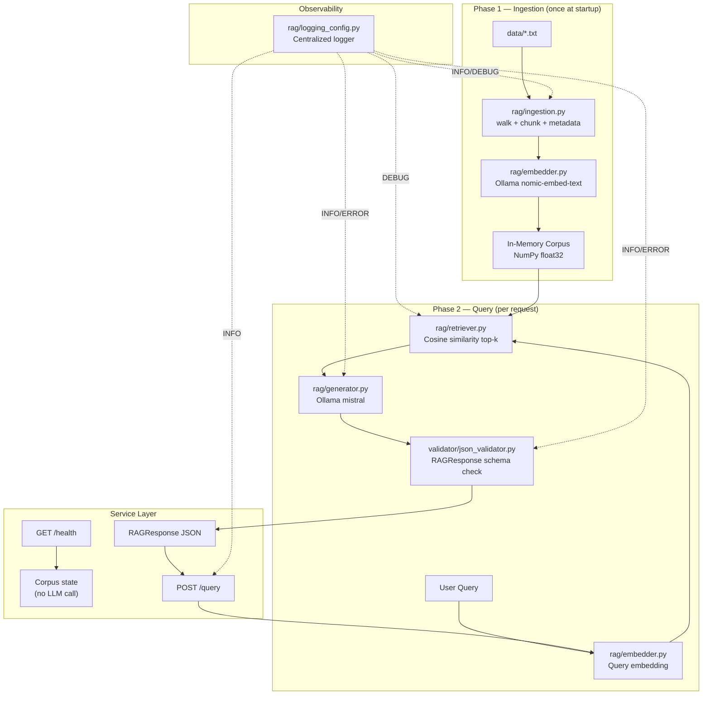

# Enterprise RAG System — FP&A Platform Edition

[](https://github.com/pavann19/enterprise-rag-system/actions/workflows/ci.yml)
[](LICENSE)

A modular, deterministic Retrieval-Augmented Generation (RAG) pipeline built to power enterprise Financial Planning & Analysis (FP&A) workflows. Designed for seamless backend integration, this system extracts, synthesizes, and enforces structured insights from complex financial documents, policy manuals, and operational reports.

The pipeline is exposed via a FastAPI service layer, enabling integration with multi-step agentic AI workflows and internal decision-support systems. Output is schema-validated on every request. Inference runs entirely on local infrastructure (Ollama) by default; an explicit, opt-in cloud path exists for public demo hosting — see [Hosted / Public Demo](#-hosted--public-demo).

---

## 🏗️ System Architecture & Workflow


```mermaid
graph TD
    subgraph Ingestion ["Phase 1 — Ingestion (once at startup)"]
        A["data/*.txt"] --> B["rag/ingestion.py\nwalk + chunk + metadata"]
        B --> C["rag/embedder.py\nOllama nomic-embed-text"]
        C --> D["In-Memory Corpus\nNumPy float32"]
    end

    subgraph Query ["Phase 2 — Query (per request)"]
        E["User Query"] --> F["rag/embedder.py\nQuery embedding"]
        F --> G["rag/retriever.py\nCosine similarity top-k"]
        G --> H["rag/generator.py\nOllama mistral"]
        H --> I["validator/json_validator.py\nRAGResponse schema check"]
    end

    subgraph ServiceLayer ["Service Layer"]
        J["GET /health"] --> K["Corpus state\n(no LLM call)"]
        L["POST /query"] --> F
        I --> M["RAGResponse JSON"]
        M --> L
    end

    subgraph Observability ["Observability"]
        N["rag/logging_config.py\nCentralized logger"]
        N -.->|INFO/DEBUG| B
        N -.->|DEBUG| G
        N -.->|INFO/ERROR| H
        N -.->|INFO/ERROR| I
        N -.->|INFO| L
    end

    D --> G
```

---

## 🏢 Enterprise Deployment Model

This system is built for containerized microservice environments. The RAG pipeline is packaged behind a stateless FastAPI service, making it readily consumable by upstream orchestration layers, enterprise dashboards, or multi-step agentic AI frameworks.

| Property | Implementation |
|---|---|
| **Integration** | REST API (`/query`, `/health`) designed for backend-to-backend consumption |
| **Agentic AI Ready** | Strict `RAGResponse` typing ensures predictable tool usage for autonomous agents |
| **Data Residency** | Inference runs on local infrastructure by default (`EMBED_BACKEND=ollama`, `GEN_BACKEND=ollama`); switching either to its cloud alternative is a deliberate, explicit config choice — never an implicit fallback |
| **Vector Storage** | NumPy baseline for prototyping; designed for zero-friction scaling to FAISS or Qdrant |

This architecture bridges the gap between secure local LLM execution and scalable enterprise service patterns.

---

## 📐 Design Principles

### 1. Strict Separation of Concerns

Each pipeline stage is an independent Python module with a single responsibility:

| Module | Responsibility | External calls |
|---|---|---|
| `rag/_http.py` | Shared Ollama HTTP transport | Ollama (localhost) |
| `rag/logging_config.py` | Centralized logging configuration | None |
| `rag/ingestion.py` | Multi-document loading, chunking, and embedding | Ollama `/api/embeddings` |
| `rag/chunker.py` | Word-boundary text segmentation | None |
| `rag/embedder.py` | Dense vector encoding | Ollama `/api/embeddings` (default) or in-process sentence-transformers |
| `rag/vector_store.py` | Pluggable similarity index (NumPy / FAISS), with save/load | None |
| `rag/retriever.py` | Translates vector-store hits into chunk text + source metadata | None |
| `rag/generator.py` | Context-grounded generation | Ollama `/api/generate` (default), Claude API, or Groq API |
| `validator/json_validator.py` | Output schema enforcement | None |
| `service/api.py` | FastAPI REST service layer | None |
| `app.py` | Pipeline orchestration (CLI) | None |

### 2. Deterministic Structured Output

Every pipeline response is enforced against the `RAGResponse` TypedDict before it is returned. The validator raises a typed `ValidationError` on any schema violation — there are no silent failures or untyped dict returns in the public API.

```python
class RAGResponse(TypedDict):
    query:   str               # original user question
    answer:  str               # LLM-generated, context-grounded answer
    sources: List[SourceEntry] # top-k retrieved passages, each {"text", "source"}
    model:   str                # Ollama generation model used
```

### 3. Pluggable Vector Store, With Persistence

Similarity search is hidden behind a `VectorStore` interface (`rag/vector_store.py`) with two interchangeable backends:

- **`numpy`** (default) — exact cosine similarity over a `float32` array. Zero extra dependencies.
- **`faiss`** (optional, `pip install faiss-cpu`) — exact inner-product search via `IndexFlatIP` over L2-normalized vectors, same ranking semantics, backed by a purpose-built similarity-search library.

`rag/retriever.py` calls `vector_store.search()` and has no idea which backend is underneath — swapping backends is a one-line config change (`VECTOR_BACKEND` in `app.py`), not a rewrite.

Both backends persist to disk. `rag/ingestion.py::ingest()` accepts a `cache_dir`; the embedded corpus (chunks, metadata, and the index itself) is cached under a fingerprint hashed from document contents + chunking/embedding config. An unchanged corpus loads straight from disk on the next run — no re-embedding, no Ollama calls — until a document or config actually changes.

### 4. Single Transport Layer

All Ollama API calls are routed through `rag/_http.py::ollama_post()`, with the Ollama host itself read once from the `OLLAMA_HOST` environment variable (default `http://localhost:11434`). This is what lets the exact same code talk to a bare-metal Ollama install or to the `ollama` service in `docker-compose.yml` with no branching — and gives timeout handling and connection-error messages one place to live instead of being duplicated across `embedder.py` and `generator.py`.

---

## 🚀 Local Setup

### Prerequisites

```bash
# 1. Install Ollama — https://ollama.ai/download

# 2. Pull inference models
ollama pull nomic-embed-text   # embedding model (274 MB)
ollama pull mistral            # generation model (or: llama3, phi3, gemma)

# 3. Start the Ollama server
ollama serve
```

### Install Python dependencies

```bash
pip install -r requirements.txt    # numpy, fastapi, uvicorn, pydantic, streamlit, pytest
```

### Run — CLI

```bash
cd enterprise-rag-system
python app.py
python app.py "What is the role of cosine similarity in retrieval?"
```

### Run — Browser UI

```bash
python -m streamlit run streamlit_app.py
# → http://localhost:8501
```

---

## 🐳 Run With Docker

One command brings up Ollama, pulls the two required models into a persistent
volume, and starts both the API and the browser UI — no local Python
environment or manual `ollama pull` needed:

```bash
docker compose up --build
```

| Service | URL | Notes |
|---|---|---|
| `ollama` | `localhost:11434` | Model server; models persist in the `ollama_models` volume |
| `ollama-pull` | — | One-shot: pulls `nomic-embed-text` + `mistral`, then exits. Only re-runs work if the volume is empty |
| `api` | `localhost:8000` | FastAPI service — `/health`, `/query`, `/docs` |
| `ui` | `localhost:8501` | Streamlit browser UI |

The corpus cache (`rag/ingestion.py`'s `cache_dir`) lives in a `corpus_cache`
volume shared by `api` and `ui`, so ingestion only runs once even though both
services start independently.

First run pulls ~5 GB of model weights, so expect it to take several
minutes; subsequent `docker compose up` runs reuse the `ollama_models`
volume and skip straight to serving.

```bash
docker compose down          # stop, keep volumes (models + cache)
docker compose down -v       # stop and wipe volumes — next run re-pulls everything
```

---

## ☁️ Hosted / Public Demo

The default configuration (`EMBED_BACKEND=ollama`, `GEN_BACKEND=ollama`) can't
be reached by someone clicking a public link — free hosting platforms like
Streamlit Community Cloud or Hugging Face Spaces don't let you run a
persistent background server alongside the app, so there's no Ollama for the
hosted process to talk to.

`rag/embedder.py` supports one opt-in cloud alternative for embeddings, and
`rag/generator.py` supports two for generation — pick whichever fits your
budget/rate limits:

```bash
EMBED_BACKEND=local          # sentence-transformers, runs in-process — no server, no API key
GEN_BACKEND=anthropic        # Claude API — requires ANTHROPIC_API_KEY
# or
GEN_BACKEND=groq             # Groq API (Llama models) — requires GROQ_API_KEY, generous free tier
```

All are inert unless explicitly set — the default remains fully local. To
deploy on Streamlit Community Cloud:

1. Push this repo to GitHub (already done if you're reading this from there).
2. On [share.streamlit.io](https://share.streamlit.io), point a new app at
   `streamlit_app.py`.
3. In the app's *Secrets*, set (pick one generation backend):
   ```toml
   EMBED_BACKEND = "local"
   GEN_BACKEND = "groq"
   GROQ_API_KEY = "gsk_..."
   ```
4. Add `sentence-transformers` and `groq` (or `anthropic`) to `requirements.txt`
   — they're listed there already, commented out — uncomment the ones you need
   for this deployment.

**Not yet done:** no instance of this has actually been deployed from this
repository — the backend code and its error paths are unit-tested (see
`tests/test_embedder_backends.py`, `tests/test_generator_backends.py`), and
the `local` embedding backend has been run manually end-to-end, but the steps
above describing the Streamlit Cloud deploy itself have not been executed.
Deploying requires your own Streamlit Cloud / HF Spaces account and API key,
so that last step is yours to run.

---

## 📁 Multi-Document Corpus Support

The ingestion pipeline automatically scans the `data/` directory and builds a unified embedding corpus across multiple documents. Each chunk retains source-level metadata, enabling:

- **Cross-document retrieval** — a single query searches across all loaded documents simultaneously
- **Source attribution** — every retrieved passage is annotated with its originating filename
- **Auditability** — the full `RAGResponse` includes which document each answer was drawn from
- **Future filtering** — source metadata can be extended to support filtering by document type, date, or classification level

This enables retrieval across heterogeneous enterprise documents such as financial policies, budget reports, and compliance manuals.

### Current Corpus

```text
data/
├── financial_policy.txt       ← expense authorization, variance policy, procurement rules
├── budgeting_framework.txt    ← planning calendar, headcount budgeting, scenario planning
└── audit_controls.txt         ← COSO framework, control testing, findings remediation
```

To add documents, drop any `.txt` file into `data/` and restart the application. No code changes required.

---

## 🔄 Pipeline Flow (Step-by-Step)

**Phase 1 — Ingestion** *(executed once per knowledge base)*

| Step | Module | Action |
|---|---|---|
| 1 | `chunker.py` | Segments document into overlapping word-boundary chunks (configurable size & overlap) |
| 2 | `embedder.py` | Encodes each chunk via `POST /api/embeddings` → `float32` NumPy array |

**Phase 2 — Query** *(executed per user question)*

| Step | Module | Action |
|---|---|---|
| 3 | `embedder.py` | Encodes the query using the same embedding model |
| 4 | `retriever.py` | Computes cosine similarity; returns top-k `(passage, score)` tuples |
| 5 | `generator.py` | Injects passages into a structured RAG prompt; calls `POST /api/generate` |
| 6 | `json_validator.py` | Validates output against `RAGResponse` schema; raises `ValidationError` on failure |

---

## ⚙️ Configuration

Runtime parameters are declared as named constants at the top of `app.py`. Most
read an environment variable first and fall back to a local-only default, so
nothing has to change in code to switch environments — only what's set before
the process starts:

```python
CHUNK_SIZE     = 300           # approximate characters per chunk
CHUNK_OVERLAP  = 50            # character overlap between chunks
TOP_K          = 3             # passages injected into the generation prompt
VECTOR_BACKEND = "numpy"       # or "faiss" — see rag/vector_store.py
CACHE_DIR      = Path(...) / ".cache" / "corpus"   # persisted embeddings; delete to force re-embedding

EMBED_BACKEND  = os.environ.get("EMBED_BACKEND", "ollama")   # or "local" (sentence-transformers)
EMBED_MODEL    = os.environ.get("EMBED_MODEL", ...)           # per-backend default if unset

GEN_BACKEND    = os.environ.get("GEN_BACKEND", "ollama")     # or "anthropic"/"groq" (cloud)
GEN_MODEL      = os.environ.get("GEN_MODEL", ...)             # per-backend default if unset
```

| Env var | Values | Default | Effect |
|---|---|---|---|
| `OLLAMA_HOST` | any URL | `http://localhost:11434` | Where `rag/_http.py` sends Ollama requests — `http://ollama:11434` under docker-compose |
| `EMBED_BACKEND` | `ollama` \| `local` | `ollama` | `local` runs sentence-transformers in-process, no server needed |
| `EMBED_MODEL` | model name | backend-specific | `nomic-embed-text` (ollama) / `all-MiniLM-L6-v2` (local) |
| `GEN_BACKEND` | `ollama` \| `anthropic` \| `groq` | `ollama` | Cloud backends call their respective hosted API instead of a local model |
| `GEN_MODEL` | model name | backend-specific | `mistral` (ollama) / `claude-haiku-4-5-20251001` (anthropic) / `llama-3.3-70b-versatile` (groq) |
| `ANTHROPIC_API_KEY` | API key | — | Required only when `GEN_BACKEND=anthropic` |
| `GROQ_API_KEY` | API key | — | Required only when `GEN_BACKEND=groq`. **Never write the key itself into a tracked file** — set it as an actual environment variable, a gitignored `.env`, or your host's secrets manager |

---

## ✅ Testing

140 tests across two layers:

- **Unit tests** for every pure-function module — chunking, vector search, retrieval,
  schema validation, prompt construction, HTTP config, backend dispatch — including
  boundary conditions (empty/whitespace input, dimension mismatches, tied scores,
  unicode, zero-overlap, malformed schemas, missing dependencies/API keys), not just
  the happy path.
- **Integration tests** for both entry points — `service/api.py` via FastAPI's
  `TestClient` (routing, request validation, lifespan startup errors, HTTP status
  mapping) and `streamlit_app.py` via Streamlit's `AppTest` harness (full script
  execution, widget interaction, error rendering) — with ingestion and generation
  stubbed out, so none of this requires a running Ollama instance.

```bash
pip install -r requirements.txt
python -m pytest tests/ -v
```

Runs automatically on every push/PR via [GitHub Actions](.github/workflows/ci.yml)
against Python 3.11 and 3.12.

This test pass also caught two real bugs, fixed alongside the tests that found them:
`validate()` raised an unhandled `AttributeError` instead of `ValidationError` on
non-dict input, and `chunk_text(..., overlap=0)` always carried one word into the
next chunk instead of zero, due to a loop that ran once before checking its own exit
condition.

**Not yet covered:** live integration against a running Ollama instance (that's what
`eval/run_eval.py` exercises for retrieval), and answer-quality evaluation. See Roadmap.

---

## 📈 Retrieval Evaluation

`eval/` scores retrieval quality (does the right document come back) against a
15-query hand-labeled golden set — MRR, hit-rate@k, precision@k. No LLM judge, no
cloud dependency; see [`eval/README.md`](eval/README.md) for what this does and
does not measure, and why answer-quality metrics (faithfulness, relevancy) are out
of scope for now.

```bash
ollama serve
python -m eval.run_eval
```

---

## 🌐 API Usage

The FastAPI service wraps the full pipeline behind a REST interface. The corpus is loaded once at startup and held in memory for subsequent requests.

### Start the server

```bash
uvicorn service.api:app --reload
# Available at http://127.0.0.1:8000
# Interactive docs at http://127.0.0.1:8000/docs
```

### Health check

```bash
curl http://127.0.0.1:8000/health
```

```json
{
  "status": "ok",
  "embedding_model": "nomic-embed-text",
  "generation_model": "mistral",
  "documents_loaded": 3
}
```

The health endpoint does not trigger embeddings or LLM calls. It reads in-memory state only.

### Query

```bash
curl -X POST http://127.0.0.1:8000/query \
     -H "Content-Type: application/json" \
     -d '{"query": "Explain the audit control policy."}'
```

```json
{
  "query": "Explain the audit control policy.",
  "answer": "The audit control policy is organised around the COSO framework...",
  "sources": [
    {"text": "Section 2 — COSO Framework Alignment...", "source": "audit_controls.txt"},
    {"text": "Tier 3 — Capital and Strategic Expenditures...", "source": "financial_policy.txt"}
  ],
  "model": "mistral"
}
```

### Error codes

| Code | Condition |
|---|---|
| `422` | Empty or malformed request body |
| `503` | Ollama is unreachable at query time |
| `500` | Pipeline output failed schema validation |

The CLI (`python app.py`) and Streamlit UI (`streamlit run streamlit_app.py`) remain fully independent of the API server.

---

## 🔎 Observability

All pipeline modules emit structured log lines via Python's built-in `logging` module. No external logging libraries are used.

Logging is centralised in `rag/logging_config.py`. Every module calls `get_logger(__name__)` to obtain a child logger under the `rag.*` namespace. All output goes to stdout.

**Log format:**

```text
YYYY-MM-DD HH:MM:SS [LEVEL   ] logger.name — message
```

**What is captured:**

| Stage | Level | Events |
|---|---|---|
| Ingestion | INFO | Start, document count, chunk totals, embedding complete |
| Ingestion | DEBUG | Per-document chunk counts |
| Retrieval | DEBUG | Top-k passage scores and source filenames |
| Generation | INFO | Request (model, query preview), success (answer length) |
| Generation | ERROR | Ollama connection failure |
| Validation | INFO | Pass — query preview and source count |
| Validation | ERROR | Fail — field name and reason |
| API service | INFO | Startup, `/health` hits, query received, query complete |

**Default level:** `INFO` — sufficient for production monitoring.

**Enable DEBUG** for retrieval scores and per-document chunk counts:

```python
import logging
logging.getLogger("rag").setLevel(logging.DEBUG)
```

---

## 🧩 Extension Points

The system is designed to be extended without modifying core pipeline logic:

| Extension | How |
|---|---|
| **Swap retrieval backend** | Set `VECTOR_BACKEND = "faiss"` in `app.py`; `retrieve()` signature unchanged |
| **Swap to Qdrant/Pinecone at scale** | Add a new backend class to `rag/vector_store.py` implementing `search()`/`save()`/`load()` |
| **Swap embedding model** | Change `EMBED_MODEL` constant in `app.py`; no code changes elsewhere |
| **Swap generation model** | Change `GEN_MODEL` constant in `app.py`; no code changes elsewhere |
| **Add streaming output** | Pass `"stream": true` to `generator.py`; yield tokens progressively |
| **Add re-ranking** | Insert a cross-encoder step between `retriever.py` and `generator.py` |
| **Add PDF support** | Extend `rag/ingestion.py` to call `pypdf` before chunking |

---

## 📊 Operational Characteristics

> **Not yet benchmarked.** The figures below are indicative ranges typical of these model sizes on comparable hardware, not measurements taken from this repository. No benchmark harness or captured run log exists yet — see the Roadmap for the planned evaluation harness. Treat this table as a rough expectation-setter, not a performance claim.

| Metric | CPU (6-core) | GPU (8 GB VRAM) |
|---|---|---|
| Embedding latency (per chunk) | ~0.5–2 s | ~0.05–0.2 s |
| Generation latency (mistral) | ~30–90 s | ~2–8 s |
| Memory footprint (model + app) | ~4–6 GB RAM | ~4 GB VRAM |
| Corpus re-embedding required? | Only on document change | Only on document change |

---

## 🔭 Roadmap

| Status | Priority | Item | Notes |
|---|---|---|---|
| ✅ Done | — | Unit + integration tests, CI | `tests/` (140 tests) + `.github/workflows/ci.yml`, see Testing |
| ✅ Done | High | Persist corpus embeddings | `rag/ingestion.py::ingest(cache_dir=...)` — fingerprinted on content + config, skips re-embedding on a cache hit |
| ✅ Done | High | Pluggable vector store (NumPy / FAISS) | `rag/vector_store.py`; swap via `VECTOR_BACKEND`, `retrieve()` interface unchanged |
| ✅ Done | High | Retrieval evaluation harness | `eval/` — MRR, hit-rate@k, precision@k against a 15-query golden set. Scoped-down alternative to RAGAS (no LLM judge, no cloud dependency); see `eval/README.md`. **Not yet run** — needs a live Ollama instance |
| ✅ Done | High | Containerize (Docker) | `Dockerfile` + `docker-compose.yml` — `ollama` + `api` + `ui`, one-shot model pull, persistent volumes |
| 🟡 Partial | Medium | Hosted demo | `EMBED_BACKEND=local` / `GEN_BACKEND=anthropic`\|`groq` implemented and tested, see [Hosted / Public Demo](#-hosted--public-demo) — actual deployment to Streamlit Cloud/HF Spaces not yet done |
| ⬜ | Medium | Qdrant/Pinecone backend | New `VectorStore` implementation for true horizontal scale beyond FAISS's single-process index |
| ⬜ | Medium | PDF ingestion | Extend `rag/ingestion.py` with `pypdf`; no pipeline changes needed |
| ✅ Done | Medium | Integration tests for `service/api.py` / `streamlit_app.py` | FastAPI `TestClient` + Streamlit `AppTest`, ingestion/generation stubbed — see Testing |
| ⬜ | Medium | Answer-quality evaluation (faithfulness/relevancy) | Requires an LLM judge — local model or cloud API; deliberately deferred, see `eval/README.md` |
| ⬜ | Low | Streaming token output | Client-side progressive rendering |
| ⬜ | Low | Cross-encoder re-ranking | Improved passage precision at the cost of additional latency |
| ⬜ | Low | Basic auth / rate limiting on `service/api.py` | Only relevant once the API is exposed beyond localhost |

---

## 🚀 Key Engineering Decisions

**Data Residency & Security:** By default, the full pipeline runs on locally hosted Ollama models — no cloud API calls, no data egress. An explicit opt-in path (`EMBED_BACKEND=local`, `GEN_BACKEND=anthropic` or `groq`) trades that guarantee for public-demo reachability; see [Hosted / Public Demo](#-hosted--public-demo) for exactly what that changes.

**Deterministic Structured Output:** Rather than returning raw text, the output is passed through `json_validator.py`. It enforces a `RAGResponse` TypedDict schema and raises a `ValidationError` on failure, ensuring reliable integration with downstream enterprise APIs.

**Decoupled Architecture:** Retrieval (`retriever.py`) and Generation (`generator.py`) are strictly independent modules. This allows for isolated unit testing and enables the system to easily swap the lightweight NumPy vector store for FAISS or Pinecone at massive scale.

**Shared HTTP Transport:** A single `_http.py` module handles all Ollama communication, eliminating boilerplate and centralizing timeout and error handling.

---

## 💻 Tech Stack

| Layer | Technology |
|---|---|
| **Language** | Python — stdlib-heavy, minimal external dependencies |
| **AI/LLM Engine** | Ollama (Mistral / Llama3 for generation, Nomic for embeddings) |
| **Data Storage** | In-Memory Vector Computation (NumPy float32) |
| **Architecture Patterns** | RAG, Workflow Orchestration, Typed Schema Validation |
| **UI** | Streamlit (optional browser interface) |

---

## ⚡ Pipeline Execution

**Ingestion:** Documents are parsed and split into overlapping segments to preserve cross-boundary semantic context.

**Embedding:** Chunks are vectorized via `/api/embeddings` and stacked into a dense `np.ndarray` corpus.

**Retrieval:** User queries are embedded with the same model, and cosine similarity ranks the top-k highest-scoring passages from the corpus.

**Generation:** A strict system prompt injects the retrieved context and constrains the model to ground its answer entirely in the provided passages — parametric knowledge is explicitly excluded.

**Validation:** The response is structurally validated against the `RAGResponse` TypedDict schema before being returned to the caller. Any schema violation raises a `ValidationError`, which propagates cleanly to the orchestration layer.
